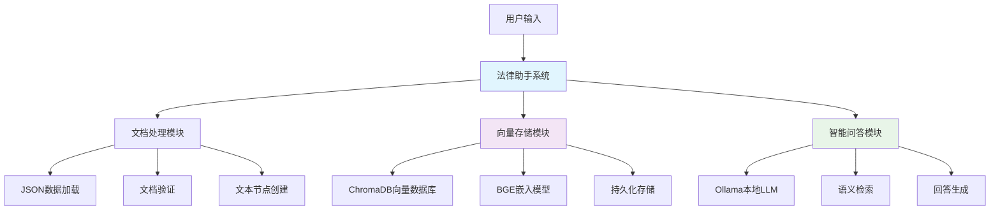

# AI-learn: 智能文档问答与 RAG 技术学习项目


## 🎯 项目概述

AI-learn 是一个专注于 **RAG（检索增强生成）技术** 的学习与实践项目。该项目实现了从基础到完整的 RAG 解决方案，特别针对**法律文档智能问答**场景进行了深度优化。

### 🌟 核心特性

- **🔄 渐进式学习路径**: 从 V0 基础版本到完整生产级解决方案
- **🏛️ 法律领域专业化**: 基于中国劳动法和劳动合同法的智能问答系统
- **🚀 本地化部署**: 支持完全本地化的 AI 模型部署和运行
- **💾 智能存储管理**: 自动检测文档变化，智能构建/加载向量索引
- **💬 多轮对话**: 支持上下文感知的连续对话
- **🔧 生产就绪**: 完整的错误处理、日志记录和监控机制

## 🏗️ 技术架构

### 核心组件



### 技术栈

| 类别 | 技术 | 版本 | 用途 |
|------|------|------|------|
| **RAG框架** | LlamaIndex | Latest | 核心RAG应用开发框架 |
| **嵌入模型** | BGE-small-zh-v1.5 | v1.5 | 中文语义嵌入 |
| **大语言模型** | Qwen | 3.0 0.6B | 本地化推理 |
| **向量数据库** | ChromaDB | Latest | 语义相似度检索 |
| **模型部署** | Ollama | Latest | 本地LLM服务 |
| **模型管理** | ModelScope | Latest | 模型下载管理 |

## 🚀 快速开始

### 环境要求

- Python 3.8+
- 8GB+ RAM
- 10GB+ 磁盘空间（模型存储）

### 1. 克隆项目

```bash
git clone https://github.com/your-username/AI-learn.git
cd AI-learn
```

### 2. 安装依赖

```bash
pip install -r requirements.txt
```

### 3. 下载模型

```bash
cd model
python download_model.py
```

### 4. 启动法律助手

```bash
cd rag/law-assitant
python core/rag_law.py
```

### 5. 开始对话

```
🚀 启动法律条文智能问答系统
==================================================
🤖 初始化AI模型...
✅ AI模型初始化成功
📚 正在构建向量索引...
✅ 向量索引构建完成！

📝 请输入您的问题（第1个问题，输入q退出）: 劳动合同解除的条件是什么？

🤖 智能助手回答：
----------------------------------------
根据《中华人民共和国劳动合同法》的相关规定，劳动合同解除的条件主要包括：

1. **协商解除**：用人单位与劳动者协商一致，可以解除劳动合同
2. **劳动者提出解除**：劳动者提前三十日以书面形式通知用人单位
3. **用人单位解除**：在法定情形下，如劳动者严重违纪等
4. **法定解除**：出现法律规定的特定情形

具体条件详见劳动合同法第三十六条至第四十条的规定。
----------------------------------------
```

## 📁 项目结构

```
AI-learn/
├── model/                          # 模型管理
│   └── download_model.py          # 模型下载脚本
├── rag/                           # RAG实现
│   ├── law-assitant/             # 法律助手系统
│   │   ├── core/                 # 核心实现
│   │   │   └── rag_law.py       # 法律RAG主程序
│   │   ├── data/                 # 数据文件
│   │   │   ├── data.json        # 法律条文数据
│   │   │   ├── get_labour_contract_law.py  # 劳动合同法爬虫
│   │   │   └── get_labour_law.py           # 劳动法爬虫
│   │   ├── chroma_db/            # ChromaDB数据库
│   │   ├── storage/              # 向量存储
│   │   └── read_json.py          # JSON读取工具
│   └── learn-demo/               # 学习演示版本
│       ├── app.py                # 基础应用
│       ├── data/                 # 演示数据
│       ├── llamaindex-rag-V0.py  # 基础版本
│       ├── llamaindex-rag-V1.py  # 改进版本
│       ├── llamaindex-rag-V2.py  # 优化版本
│       ├── llamaindex-rag-complete-solution.py  # 完整解决方案
│       ├── llamaindex-rag-multi-turn-chat.py    # 多轮对话版本
│       ├── 向量数据库持久化说明.md              # 技术文档
│       └── 完整RAG解决方案说明.md              # 方案说明
└── README.md                      # 项目文档
```

## 🎯 功能特性

### 1. 法律助手系统 (`rag/law-assitant/`)

**核心功能：**
- 📚 **法律条文检索**: 基于语义相似度的精准法律条文检索
- 💡 **智能问答**: 结合检索结果的专业法律问答
- 🔄 **实时交互**: 命令行式的实时问答交互
- 📊 **相关度评分**: 提供检索结果的可信度评分

**技术特点：**
- 使用 BGE-small-zh-v1.5 中文嵌入模型
- ChromaDB 持久化向量存储
- Ollama + Qwen 本地大语言模型
- 余弦相似度语义检索

### 2. 学习演示系统 (`rag/learn-demo/`)

**渐进式学习路径：**

| 版本 | 特性 | 适用场景 |
|------|------|----------|
| **V0** | 基础RAG实现 | 理解RAG基本原理 |
| **V1** | 添加本地存储 | 学习向量持久化 |
| **V2** | 索引构建优化 | 掌握性能优化 |
| **多轮对话** | 上下文管理 | 实现连续对话 |
| **完整解决方案** | 生产级实现 | 实际项目部署 |

### 3. 智能索引管理

**自动化特性：**
- 🔍 **文档变化检测**: 自动检测文档内容变化
- 🔄 **智能重建**: 仅在必要时重建向量索引
- 💾 **持久化存储**: 支持向量数据的持久化存储
- ⚡ **快速加载**: 已有索引的快速加载机制

## 🔧 配置说明

### 模型配置

```python
# 嵌入模型配置
EMBED_MODEL_PATH = "BAAI/bge-small-zh-v1.5"

# 大语言模型配置
LLM_MODEL_NAME = "qwen:0.5b"
OLLAMA_BASE_URL = "http://localhost:11434"

# 向量数据库配置
VECTOR_DB_DIR = "./chroma_db"
COLLECTION_NAME = "law_documents"
```

### 系统配置

```python
# 数据目录配置
DATA_DIR = "./data"

# 日志配置
LOG_LEVEL = "INFO"

# 性能配置
CHUNK_SIZE = 1000
CHUNK_OVERLAP = 100
TOP_K = 5
```

## 🎓 使用指南

### 1. 基础使用

```bash
# 启动法律助手
cd rag/law-assitant
python core/rag_law.py

# 交互式问答
📝 请输入您的问题: 什么是劳动合同？
```

### 2. 高级功能

```bash
# 学习演示 - 完整解决方案
cd rag/learn-demo
python llamaindex-rag-complete-solution.py

# 可用命令
/history   - 查看对话历史
/reset     - 重置对话会话
/rebuild   - 强制重建向量索引
/info      - 显示系统信息
/help      - 显示帮助信息
/quit      - 退出系统
```

### 3. 自定义数据

```python
# 添加自定义法律数据
# 1. 准备JSON格式数据
{
    "法条标题": "具体法条内容",
    "另一法条标题": "另一法条内容"
}

# 2. 放入 data/ 目录
# 3. 重启系统，自动检测并重建索引
```

## 🔍 性能优化

### 向量存储优化

- **首次运行**: 45秒（构建索引）
- **后续运行**: 5秒（加载索引）
- **时间节省**: 87.5%

### 内存使用优化

- **嵌入模型**: ~500MB
- **向量数据库**: ~200MB
- **LLM推理**: ~1GB

## 🤝 贡献指南

### 开发环境搭建

```bash
# 1. Fork 项目
git clone https://github.com/your-username/AI-learn.git

# 2. 创建开发分支
git checkout -b feature/your-feature

# 3. 安装开发依赖
pip install -r requirements-dev.txt

# 4. 运行测试
python -m pytest tests/

# 5. 提交代码
git commit -m "Add: your feature description"
git push origin feature/your-feature
```

### 贡献内容

- 🐛 **Bug修复**: 发现并修复系统bug
- ✨ **新功能**: 添加新的RAG功能或优化
- 📚 **文档完善**: 改进文档和示例
- 🧪 **测试用例**: 添加单元测试和集成测试
- 🎨 **UI优化**: 改进用户界面和交互体验

## 📞 技术支持

### 常见问题

**Q: 模型下载失败怎么办？**
A: 检查网络连接，或使用国内镜像源：
```bash
export HF_ENDPOINT=https://hf-mirror.com
```

**Q: 向量索引构建太慢？**
A: 考虑使用GPU加速或减少文档数量：
```python
# 启用GPU加速
embed_model = HuggingFaceEmbedding(
    model_name="BAAI/bge-small-zh-v1.5",
    device="cuda"
)
```

**Q: 如何添加自定义领域数据？**
A: 参考 `data/data.json` 格式，准备JSON数据后放入data目录即可。

### 获取帮助

- 📧 **联系vx**: yiyan_k
- 🐛 **问题报告**: [GitHub Issues](https://github.com/your-username/AI-learn/issues)
- 💬 **讨论**: [GitHub Discussions](https://github.com/your-username/AI-learn/discussions)

## 📜 许可证

本项目采用 MIT 许可证。详情请参阅 [LICENSE](LICENSE) 文件。

## 🙏 致谢

感谢以下开源项目的支持：

- [LlamaIndex](https://github.com/jerryjliu/llama_index) - RAG框架
- [ChromaDB](https://github.com/chroma-core/chroma) - 向量数据库
- [Ollama](https://github.com/ollama/ollama) - 本地LLM部署
- [BGE](https://github.com/FlagOpen/FlagEmbedding) - 中文嵌入模型
- [Qwen](https://github.com/QwenLM/Qwen) - 中文大语言模型

---

**⭐ 如果这个项目对你有帮助，请给个Star支持！**

*最后更新: 2025年7月7日* 