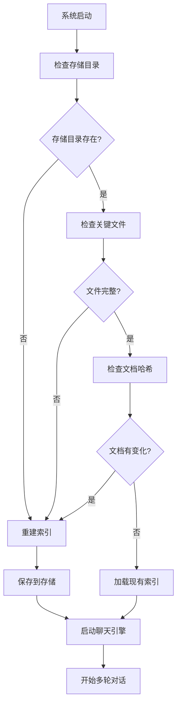

# 完整 RAG 解决方案说明

## 🎯 解决方案概述

这个完整的 RAG 解决方案结合了 V2（索引构建）、V3（存储加载）和 V4（多轮对话）的所有优点，实现了一个**智能、自适应、生产就绪**的文档问答系统。

## 🔄 智能工作流程

### 系统启动时的决策流程



### 智能检测逻辑

```python
def should_rebuild_index(self):
    """智能判断是否需要重建索引"""
    
    # 1. 检查存储目录
    if not os.path.exists(self.storage_path):
        return True, "存储目录不存在"
    
    # 2. 检查关键文件
    required_files = ["default__vector_store.json", "docstore.json", "index_store.json"]
    for file in required_files:
        if not os.path.exists(os.path.join(self.storage_path, file)):
            return True, f"缺少关键文件: {file}"
    
    # 3. 检查文档内容变化（通过哈希对比）
    current_hash = self.get_docs_hash()
    metadata = self.load_metadata()
    
    if current_hash and metadata.get("docs_hash") != current_hash:
        return True, "文档内容已变化"
    
    return False, "索引无需重建"
```

## 🏗️ 架构设计

### 系统组件

| 组件 | 功能 | 实现方式 |
|------|------|----------|
| **文档监控** | 检测文档变化 | MD5哈希对比 |
| **索引管理** | 智能构建/加载 | 条件判断逻辑 |
| **存储持久化** | 向量数据存储 | JSON文件存储 |
| **多轮对话** | 上下文管理 | ChatEngine |
| **元数据管理** | 系统状态追踪 | JSON元数据 |

### 核心类设计

```python
class CompleteRAGSolution:
    def __init__(self, docs_path, storage_path):
        # 初始化配置
        self.setup_models()        # 设置AI模型
        self.initialize_index()    # 智能索引初始化
        self.setup_chat_engine()   # 配置聊天引擎
    
    # 智能索引管理
    def should_rebuild_index()     # 判断是否需要重建
    def build_index()              # 构建新索引
    def load_index()               # 加载现有索引
    
    # 多轮对话功能
    def chat()                     # 处理对话
    def reset_conversation()       # 重置会话
    def save_conversation()        # 保存历史
    
    # 系统管理功能
    def show_system_info()         # 显示系统信息
    def rebuild_index()            # 强制重建
```

## 🌟 主要优势

### 1. **智能适应性**

#### 自动模式选择
```python
# 首次运行或文档更新
🔍 正在检查向量索引状态...
🚧 需要重建索引: 存储目录不存在
📁 正在加载文档: /path/to/docs
🔧 正在构建向量索引（计算文档嵌入）...
💾 正在保存索引到: /path/to/storage
✅ 向量索引构建并保存完成！

# 后续运行
🔍 正在检查向量索引状态...
✅ 索引无需重建，直接加载现有索引
📚 正在从本地存储加载向量索引
✅ 向量索引加载完成！
```

#### 文档变化检测
```python
def get_docs_hash(self):
    """计算文档内容哈希"""
    # 支持单文件和目录
    # 自动检测内容变化
    # 触发智能重建
```

### 2. **完整的生命周期管理**

#### 开发阶段
```python
# 第一次运行 - 自动构建
rag = CompleteRAGSolution()  
# → 检测到无存储，自动构建索引

# 修改文档后运行 - 自动检测变化
rag = CompleteRAGSolution()
# → 检测到文档变化，自动重建索引

# 正常使用 - 快速加载
rag = CompleteRAGSolution()
# → 直接加载现有索引，快速启动
```

#### 生产环境
```python
# 容器化部署
rag = CompleteRAGSolution(
    docs_path="/app/docs",
    storage_path="/app/storage"
)
# → 自动适应环境，智能初始化
```

### 3. **丰富的交互功能**

#### 命令系统
```python
可用命令:
📝 /history   - 查看对话历史
🔄 /reset     - 重置对话会话  
🔧 /rebuild   - 强制重建向量索引
📊 /info      - 显示系统信息
❓ /help      - 显示帮助信息
👋 /quit      - 退出系统
💡 直接输入问题即可开始对话
```

#### 系统信息展示
```python
📊 系统信息
====================================
📁 文档路径: /path/to/docs
💾 存储路径: /path/to/storage  
💬 对话轮次: 5
🕐 索引创建时间: 2024-01-20T10:30:00
🔧 嵌入模型: paraphrase-multilingual-MiniLM-L12-v2
🤖 语言模型: qwen1_5_1_8b_chat_qlora_xtuner_merged
```

## 📊 性能对比

### 与其他版本的对比

| 特性 | V2 | V3 | V4 | **完整方案** |
|------|----|----|----|----|
| **自动索引管理** | ❌ | ❌ | ❌ | ✅ |
| **文档变化检测** | ❌ | ❌ | ❌ | ✅ |
| **多轮对话** | ❌ | ❌ | ✅ | ✅ |
| **元数据管理** | ❌ | ❌ | ❌ | ✅ |
| **生产就绪** | ❌ | ❌ | ❌ | ✅ |
| **用户友好性** | ❌ | ❌ | ✅ | ✅ |

### 启动时间对比

```python
# 文档未变化的情况下
V2版本: ~45秒 (总是重新构建)
V3版本: ~5秒  (手动加载)
V4版本: ~5秒  (手动加载)
完整方案: ~5秒  (智能加载) + 自动检测

# 文档有变化的情况下
V2版本: ~45秒 (重新构建)
V3版本: 错误  (使用过期索引)
V4版本: 错误  (使用过期索引)
完整方案: ~45秒 (自动检测并重建)
```

## 🛠️ 使用场景

### 1. **开发环境**
```python
# 频繁修改文档的开发场景
rag = CompleteRAGSolution(
    docs_path="./docs",
    storage_path="./storage"
)
# 自动检测文档变化，无需手动重建
```

### 2. **生产环境**
```python
# Docker容器部署
rag = CompleteRAGSolution(
    docs_path="/app/docs",
    storage_path="/data/storage"
)
# 智能适应环境，稳定运行
```

### 3. **多文档项目**
```python
# 支持文档目录
rag = CompleteRAGSolution(
    docs_path="/project/all_docs/",  # 整个目录
    storage_path="/project/storage"
)
# 自动处理目录下所有文档
```

### 4. **CI/CD集成**
```python
# 在CI流程中自动更新知识库
def update_knowledge_base():
    rag = CompleteRAGSolution()
    # 自动检测代码库文档变化
    # 自动重建向量索引
    # 部署更新的知识库
```

## 🎯 最佳实践建议

### 1. **项目目录结构**
```
project/
├── docs/                    # 原始文档
│   ├── README.md
│   ├── api_docs/
│   └── tutorials/
├── rag_storage/            # 向量存储
│   ├── metadata.json
│   ├── default__vector_store.json
│   └── docstore.json
└── rag_system.py          # RAG系统脚本
```

### 2. **配置管理**
```python
# 环境变量配置
import os

docs_path = os.getenv('RAG_DOCS_PATH', './docs')
storage_path = os.getenv('RAG_STORAGE_PATH', './rag_storage')

rag = CompleteRAGSolution(docs_path, storage_path)
```

### 3. **监控和日志**
```python
# 添加日志记录
import logging

class CompleteRAGSolution:
    def __init__(self):
        self.logger = logging.getLogger(__name__)
        
    def build_index(self):
        self.logger.info("开始构建向量索引")
        # ... 构建逻辑
        self.logger.info("向量索引构建完成")
```

### 4. **容错处理**
```python
def robust_initialization(self):
    """容错初始化"""
    try:
        self.initialize_index()
    except Exception as e:
        self.logger.error(f"索引初始化失败: {e}")
        # 回退到重建索引
        self.build_index()
```

## 🚀 部署建议

### Docker 部署
```dockerfile
FROM python:3.10

WORKDIR /app
COPY requirements.txt .
RUN pip install -r requirements.txt

COPY . .
ENV RAG_DOCS_PATH=/app/docs
ENV RAG_STORAGE_PATH=/app/storage

CMD ["python", "rag_system.py"]
```

### Kubernetes 部署
```yaml
apiVersion: apps/v1
kind: Deployment
metadata:
  name: rag-system
spec:
  replicas: 1
  selector:
    matchLabels:
      app: rag-system
  template:
    metadata:
      labels:
        app: rag-system
    spec:
      containers:
      - name: rag
        image: rag-system:latest
        volumeMounts:
        - name: docs
          mountPath: /app/docs
        - name: storage
          mountPath: /app/storage
```

## 💡 总结

这个完整的 RAG 解决方案实现了：

1. **🧠 智能化**: 自动检测和适应不同场景
2. **🔄 自动化**: 无需手动管理索引构建/加载
3. **🛡️ 可靠性**: 完整的错误处理和容错机制
4. **⚡ 高效性**: 智能选择最优的初始化方式
5. **🎯 生产就绪**: 适合实际项目部署使用

这是 RAG 系统的**最佳实践实现**，解决了从开发到生产的完整生命周期需求！ 